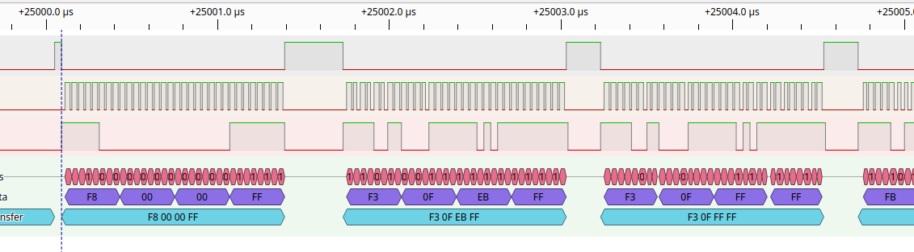
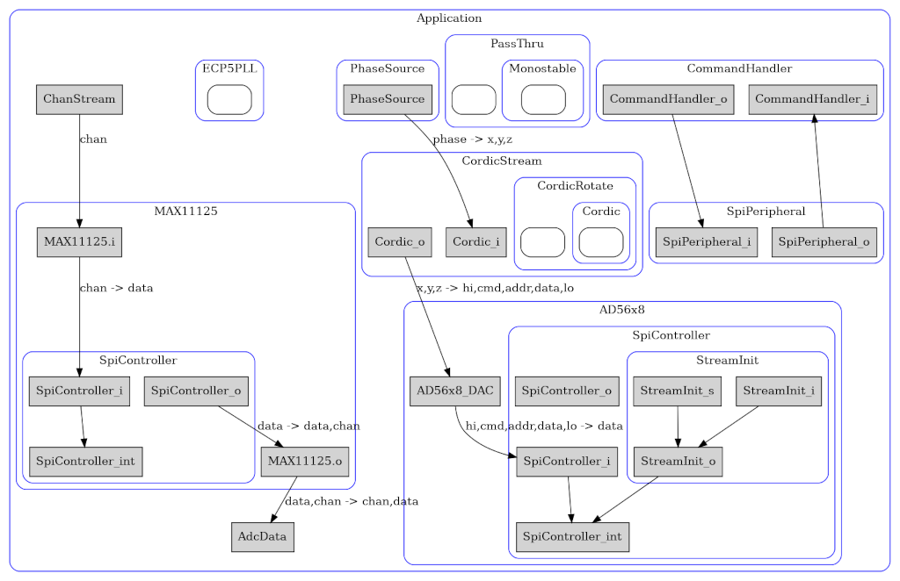
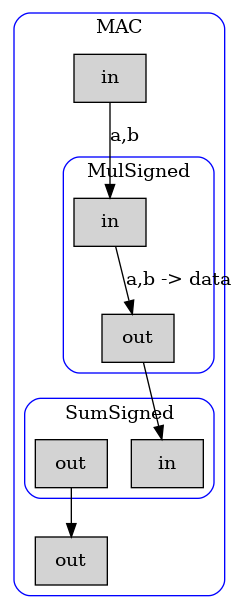

Streams library for Amaranth
=======

Streams allow interconnection between HDL blocks.
They have a simple handshake mechanism to transfer data
from a source to a sink.

The handshake is provided by the Source asserting 'valid' to show that the data is valid. The Sink asserts 'ready' to indicate that it has accepted the transfer.

In addition to 'valid'/'ready'; I discovered a need for 'first'/'last' signals to mark the start and end of blocks of data. I call these *packets*.

There has been some discussion of how Streams should be implemented in [Amaranth](https://github.com/amaranth-lang/amaranth) : 
[Stream Abstraction](https://github.com/amaranth-lang/amaranth/issues/317)

I needed Streams myself, so I put together some ideas. I decided to publish this as a work in progress. I'd welcome comments on the design. I hope that this will prove useful to the design of the Streams that eventually make their way into Amaranth.

note :- When there is full Streams support in Amaranth I aim to retire this library. We don't want multiple competing designs. I hope that the design eventually adapted by Amaranth will be to some extent compatible with this library, perhaps through an adapter class.

Example Usage
----

Connecting a Cordic stream to a SPI DAC. 
The [CORDIC](https://github.com/DaveBerkeley/cordic) module can be wrapped to provide an input Stream with "x","y","z" payloads and an output Stream with "x","y","z" payloads. The Cordic stream is fed by a PhaseSource which pushes incrementing phase data to its output stream.

In the class init method do :

        self.phase = PhaseSource(width, period, step)
        self.cordic = CordicStream(a_width=12, o_width=12)
        # init cmd=C_REF enable external reference
        init = to_packet([ 0xf80000ff, ])
        self.dac = AD56x8(init=init, chip="AD5628")

in elaborate() do :

        # Connect the phase source to the Cordic "z" input
        m.d.comb += Stream.connect(self.phase.o, self.cordic.i, mapping={"phase":"z"})

        # Set the Cordic x,y and DC offset defaults
        m.d.comb += self.cordic.i.x.eq(amplitude)
        m.d.comb += self.cordic.i.y.eq(0)
        m.d.comb += self.cordic.offset.eq(dc_offset)

        # Connect the Cordic sine output to the DAC's data input
        m.d.comb += Stream.connect(self.cordic.o, self.dac.i, exclude=["y","z"], mapping={"x":"data"})

Looking at the logic analyser output on the DAC's SPI lines, you can see the 0xf80000ff initialisation packet being sent as soon as the FPGA starts up. This is followed by a stream of sine data from the Cordic, setting the DAC output (0xf30XXXFF). The SpiController takes an optional init list that defines any initialisation sequence that should be sent to the device. The last flag controls the chip select, so you can define multiple word sequences if required.

----

Graph Generation
----

I'm keen on automatic generation of documentation and like diagrams, so I experimented with the automatic generation of interconnection diagrams using *dot*. It can produce examples like this : 

Stream objects are shown as grey boxes, the connections between them are shown as arrows : generated if you use the Stream.connect() funtion. Elaboratable objects are shown as rounded blue boxes. The code recurses down from the top module, looking for Elaboratable or Stream objects to draw. It uses [graphviz](https://www.graphviz.org/) to create the graphs using *dot*. I hope that the automated generaton of these diagrams might find wider application within Amaranth, not just for Streams.

The code used to generate the graphs is in dot.py and is invoked (in this example) with :

    if __name__ == "__main__":

        parser = argparse.ArgumentParser()
        parser.add_argument("--prog", action="store_true")
        parser.add_argument("--verbose", action="store_true")
        args = parser.parse_args()

        dut = Application()
        platform = Platform()
        platform.build(dut, do_program=args.prog, verbose=args.verbose)

        dot_path = "/tmp/ulx3s.dot"
        png_path = "stream.png"

        from streams import dot
        cluster = dot.get_clusters(dut)
        f = open(dot_path, "w")
        cluster.print_dot(f=f)
        f.close()
        dot.run(dot_path, png_path)

----
Stream Operations
----

Streams can be used for more than passing data from A to B. They can perform in-line oeprations, gather stats etc.

I've added
[ops.py](https://github.com/DaveBerkeley/streams/blob/master/streams/ops.py)
to illustrate this. 
It contains binary opertions _Mul_ and _Add_ (along with their signed versions).
These take two inputs ('a' and 'b') and produce a 'data' output which is the product
or sum of the 2 inputs.
The _Sum_ module takes an input packet, bounded by 'first' 'last' flags, and produces the
sum of the inputs.

Further operations can easily be added. These allow signal processing to be performed on streams.

These can be extended to suport [gnuradio](https://www.gnuradio.org/) style flowgraphs.

These blocks can be combined to produce more complex units : for example, a 
[MAC](https://en.wikipedia.org/wiki/Multiply%E2%80%93accumulate_operation)
unit is simply a multiplier (Mul) followed by an integrator (Sum).

----

Requirements for a Streams library
----

During the course of development of Streams I made the following observations, in no particular order.

* needs mux/demux to chop up / cat different word lengths. eg 32-bit into 4 * 8-bit words and v.v.
* needs cross clock-domain Stream adapter.
* needs a Stream buffer : that uses Memory to buffer data. Needs to flatten/expand all the payload bits, plus the first/last flags (using cat_payload(), payload_eq(data)). This allows packets to be buffered transparently.
* could be useful to have the ability to do complex mapping / multiplexing, eg Cordic "x" "y" streams into a packet (first/last) of "data","addr" pairs. This needs a well thought out mapping Module. Or is this a special case of a Mux?
* not sure about the sink/source distinction. It can find coding faults, but otherwise causes confusion. Is it needed at all? You will get a build error if it is wrong. I can't see a strong case for having it. Signal() doesn't need it.
* do we need 'param' fields, like those in Litex? (see 
[stream.py](https://github.com/enjoy-digital/litex/blob/master/litex/soc/interconnect/stream.py)  This might be useful for eg. Ethernet packets, it could contain eg. packet size.
* needs a Packet Arbiter : takes N input Streams and one output Stream, passing whole packets from one source, delimited by first/last flags.
* needs a Tee Module : this takes a single input Stream and sends to N output Streams : either pausing for the slowest, or discarding (whole packets?) if one or more outputs are not ready in time.
* IO devices (SERDES, SPI, I2S, I2C, UART etc) should all support Stream interfaces.
* Routing Module : use one field in the payload, eg "addr" to route packets to a particular output.
* SPI DAC example : multichannel SPI DAC that has a "load DAC" pin. Send N channels of data, then strobe the "load DAC" pin on the 'last' packet. This allows synchronous update of the DAC outputs, controlled by a packet of data containing multiple DAC channel words.

I've implemented the following :

* needs first/last. Simpler to have both, rather than infer first. Very useful for all sorts of packet handling.
* should have a cat_payload() to return a wide Signal of all payloads, and a payload_eq(data) to return the comb/sync commands to set them, in the same order. This allows you to take a wide signal for eg buffer memory and restore the signals after. Should be able to optionally include flags, eg first/last, so these can be preserved in eg a RAM Buffer.
* A utility function, cat_dict(d), to turn a dictionary eg. {'data':123, 'addr':345, 'first':1} into the same format as cat_payload(). This allows creation of a Const that can be payload_eq() to a Stream.
* needs option to not connect some payloads. So connect() needs an 'exclude' list. To allow you to control payload / signals elsewhere. eg. exclude=["first","last","addr"]
* needs a mapping of input to output, so, for example, connect a Cordic output to a DAC input eg mapping={"x":"data"}.
* helper Stream classes : StreamInit - which can prepend a data stream to the input. StreamNullSink - which can eat N words or N Packets. A StreamInit can be initialised like and ROM and used to eg send initialisation parameters to a SPI peripheral on boot, or send a preamble at the start of a packet. Sink can simply eat data, useful during development to flush output data.
* need good simulation sink / source classes to assist with unit tests for new designs. In fact the whole Stream architecture makes unit tests much simpler. You can often simply push data to the input sim stream, collect packets at the output and assert that they are what you expected. SourceSim and SinkSim.
* SPI example: the last flag can be used to force chip-select de-assert. So the packet translates to SPI data bursts. The Rx side can do the same thing, adding first last flags, so you can transparently send (single payload) packets over a SPI interface.
* Operations on streams allow DSP functions to be performed - much like [gnuradio](https://www.gnuradio.org/) flowgraphs.

Very much a work in progress.
